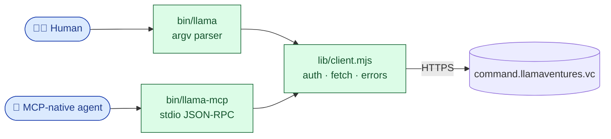

<p align="center">
  
</p>

<h1 align="center">@llamaventures/cli</h1>

<p align="center">
  <strong>The Llama Ventures CLI &amp; MCP server.</strong><br/>
  One <code>npm install</code>, one auth chain, two interfaces — humans and AI agents
  talk to <a href="https://command.llamaventures.vc">command.llamaventures.vc</a>
  through the same client.
</p>

<p align="center">
  <a href="https://www.npmjs.com/package/@llamaventures/cli"></a>
  <a href="https://github.com/Llama-Ventures/llama-cli/actions/workflows/ci.yml"></a>
  <a href="https://docs.npmjs.com/trusted-publishers"></a>
  <a href="https://nodejs.org/"></a>
  <a href="https://modelcontextprotocol.io"></a>
  <a href="LICENSE"></a>
</p>

<p align="center">
  <strong>English</strong> · <a href="README.zh-CN.md">简体中文</a>
</p>

<p align="center">
  <a href="#install">Install</a> ·
  <a href="#authenticate">Authenticate</a> ·
  <a href="#integrate-your-ai-system">Integrate your AI</a> ·
  <a href="#cli-tour">CLI</a> ·
  <a href="#mcp-server">MCP</a> ·
  <a href="#external-pitch-no-llama-account-required">External pitch</a> ·
  <a href="AGENT_BRIEFING.md">Agent briefing</a> ·
  <a href="SECURITY.md">Security</a> ·
  <a href="CHANGELOG.md">Changelog</a>
</p>

> **Public source for low-friction install. Not an open-source product.**
> Most operations require a Llama Ventures team account
> ([gavin@llamaventures.vc](mailto:gavin@llamaventures.vc) mints tokens). The one
> exception is the **public `pitch`** family — see
> [External pitch](#external-pitch-no-llama-account-required).

---

## What's in the box

```
@llamaventures/cli
├── bin/llama          interactive CLI for humans + bash
└── bin/llama-mcp      stdio MCP server, 58 typed tools — for any MCP-native agent
```

Both binaries share `lib/client.mjs` — the **same** auth chain, **same** HTTP
client, **same** error format. CLI and MCP can never drift on transport or
identity. Zero runtime dependencies for the CLI itself; the bundled MCP
server depends only on `@modelcontextprotocol/sdk` (Anthropic-maintained,
pinned exact).



---

## Install

```bash
npm i -g @llamaventures/cli
```

Requires **Node 18+** (uses native `fetch` and ESM). CI runs the matrix on 18 / 20 / 22.

Verify:

```bash
llama --version
llama auth status     # round-trips against /api/me
```

The same install puts `llama-mcp` on your `PATH` for the MCP server — no second package.

---

## Authenticate

The client tries credentials **in this order**, on every call:

| # | Source | Header sent | Best for |
|---|--------|-------------|----------|
| 1 | `llama auth login` (OAuth 2.1, OS Keychain) | `Authorization: Bearer …` | **Recommended for everyone.** One-shot browser login; tokens auto-refresh and survive reboots. |
| 2 | `gcloud auth print-identity-token` | `Authorization: Bearer …` | Workstations with gcloud already wired (zero config) |
| 3 | `$LLAMA_TOKEN` env var | `X-Llama-Token` | CI runners, sandboxed cloud agents |
| 4 | `~/.llama/token` (mode `0600`) | `X-Llama-Token` | Persistent local install (legacy PATs) |
| 5 | `~/.llama-command/config.json` | `X-Llama-Token` | CLI v0.1 — auto-migrates to `~/.llama/token` |

If both Bearer and X-Llama-Token are present, both are sent — the server tries
Bearer first and falls through to X-Llama-Token on verification failure.
Inspect the resolved identity any time with `llama auth status`.

### Browser sign-in — recommended

```bash
llama auth login           # opens browser → Google sign-in → consent → done
llama auth status          # → activeMethod=oauth, scope, identity
llama deal search acme-ai  # ready
```

`llama auth login` runs an OAuth 2.1 PKCE + RFC 8252 loopback flow against
`https://command.llamaventures.vc`, exchanges the code for an access + refresh
token pair, and stores them in the OS Keychain (macOS Keychain / Windows
Credential Manager / Linux Secret Service via [`@napi-rs/keyring`](https://www.npmjs.com/package/@napi-rs/keyring)).
Linux containers without libsecret use a 0600-mode file at `~/.llama/oauth.json`
— same posture `gcloud` / `gh` / `aws` ship with on Linux servers. Refresh
tokens rotate transparently when the access token nears expiry; a cross-process
file lock prevents two shells from burning each other's refresh during
concurrent calls.

`llama auth logout` revokes server-side via RFC 7009 and clears local storage.

### gcloud — for machines already wired with `gcloud auth login`

```bash
gcloud auth login          # one-time; pick your @llamaventures.vc account
llama auth status          # → role + email
llama deal search acme-ai  # ready
```

### Long-lived PAT — for CI / unattended environments

1. Sign in to https://command.llamaventures.vc.
2. Open `/settings/tokens` → **Mint Token**.
3. Save the `llc_…` value:

   ```bash
   llama token set llc_paste_token_here
   #  → writes ~/.llama/token (mode 0600)
   #  → round-trips /api/me before saving — bad token never lands on disk
   ```

   Or, in CI / one-shot environments:

   ```bash
   export LLAMA_TOKEN=llc_paste_token_here
   ```

> **Don't have an account?** Email
> [gavin@llamaventures.vc](mailto:gavin@llamaventures.vc). Any email — including
> non-`@llamaventures.vc` — can be granted a token; the system admin
> mints it via `/settings/tokens`. Token first-use auto-creates the user row.

---

## Integrate your AI system

This package is the **supported integration surface** for Llama Command. If
you're wiring an in-house agent, a coding assistant, or any LLM app into the
workbench, come through here — **not the raw HTTP API**. The CLI/MCP layer owns
the auth chain, the stable `Error[…]` contract, and forward-compatibility
across server schema changes ([SemVer](#stability)); raw API routes carry no
such promise and can change without notice.

The five-minute path:

1. **Get credentials** — a team account signs in with `llama auth login`; for
   headless systems, have the admin mint a PAT at
   [`/settings/tokens`](https://command.llamaventures.vc/settings/tokens) and
   set it via `llama token set` or `$LLAMA_TOKEN`.
2. **Install** — `npm i -g @llamaventures/cli` (Node 18+).
3. **Wire it in:**
   - **MCP-native agent** (Claude, Cursor, any stdio client) → point it at
     `llama-mcp`: 58 typed tools, no generic passthrough.
     See [MCP server](#mcp-server) for per-client config.
   - **Anything else** → shell out to `llama …`. Output is agent-friendly
     plain text; failures use the stable
     [`Error[…]` prefixes](#error-codes--for-agents).
4. **Onboard the agent** — have it run `llama agent-onboard` (or fetch the MCP
   `agent_briefing` prompt) at session start. It returns the **server-owned
   Agent Runtime Contract** — current workflow rules, attribution grammar,
   error recovery — always in sync with the live server, so this README never
   becomes your integration bottleneck.
5. **Verify** — `llama auth status` round-trips the resolved identity;
   `llama deal search "<anything>"` proves read access.

---

## CLI tour

The CLI is the canonical interface. The HTTP API beneath it is stable, but the
CLI handles auth, error formatting, and forward-compatibility across server
schema changes — **prefer the CLI even from inside scripts.**

```bash
# Auth + tokens
llama auth status
llama token set <llc_...>
llama token show

# Pipeline — read
llama deal search "acme ai"
llama deal list --owner alex --status Diligence      # same filters as search
llama deal show <dealId>
llama deal feed <dealId>                             # every contribution, newest first

# Pipeline — write
llama deal create "Acme AI" --description "..." --source alex --source-direction Outbound --status Interested
llama deal update <dealId> status Diligence
llama deal enrich <dealId> --dry-run
llama deal enrich <dealId> --apply --executor server_agent
llama deal enrich <dealId> --executor external_agent --prompt
llama deal agent run <dealId> --message "collect founder evidence and update typed facts"
llama deal delete  <dealId>     # soft (audit-logged)
llama deal restore <dealId>

# Status semantics
# Interested = record/track before outreach, intro, response, deck submission, or meeting.
# Outreached = contact/logged, but no response or effective relationship yet.
# Sourced    = response, intro, meeting, or another real relationship signal exists.
# sourceDirection is separate:
# Inbound    = came into the firm.
# Outbound   = we found/listed/reached out first.

# Deal Brief — ordered, typed blocks (text · link · embed · callout)
llama brief blocks       <dealId>
llama brief add-text     <dealId> --heading "..." --body "..."
llama brief add-link     <dealId> --url "..." --label "..."
llama brief add-callout  <dealId> --tone insight --heading "..." --body "..."
llama brief edit         <dealId> <blockId> [--heading ...] [--body ...]
llama brief history      <dealId> <blockId>

# Ownership + approvals
llama claim       <dealId>
llama nominate    <dealId> --user <userId>
llama approvals   list
llama approvals   decide <approvalId> approved --note "..."

# Timeline + posts
llama timeline <dealId>
llama post     <dealId> "message body" [--link url]

# Agent runtime — live Command + private Llama OS skill gateway
llama agent bootstrap
llama skills search "wiki delete tombstone"
llama skills show llama-command
llama explain https://command.llamaventures.vc/wiki/some-page
llama eval bad --last --reason "missed the llamaos weekly note"
llama eval add "last week llama dev weekly" --expect wiki:llamaos-weekly-2026-06-17

# Wiki
llama wiki search "<query>"
llama wiki read   <slug> [--lang en|zh]
# Markdown entry:
llama wiki save <slug> --title "..." --content "..." --sources "url1;url2"
# HTML entry — standalone page at /wiki/<slug> (full-viewport sandboxed iframe):
llama wiki save <slug> --title "..." --file page.html --sources "..." [--content-type html]
# Delete / restore (soft, reversible):
llama wiki delete  <slug> [--lang en|zh]
llama wiki restore <slug> [--lang en|zh]

# Mentions inbox
llama mentions
llama mentions resolve <mentionId>
```

Run `llama --help` for the group index, or `llama help all` for the full
reference — 100+ commands across deals, briefs, facts, ownership, timeline,
wiki, memos, deal-scoped HTML artifacts, mentions, skill corrections, evals,
and admin event feeds. Soft-delete is the default everywhere — every removal
is reversible and audit-logged via `deal_events`.

### Error codes — for agents

The CLI's stderr exit messages start with stable, parseable prefixes:

| Prefix | Meaning | Recovery |
|--------|---------|----------|
| `Error[NO_AUTH]` | No credentials found anywhere | `gcloud auth login` **or** `llama token set` |
| `Error[UNAUTHORIZED]` | Server rejected the credentials we sent | Token may be revoked / expired / wrong gcloud account |

The MCP server returns the same prefixes inside `isError: true` content so
agents can pattern-match without parsing prose.

---

### Golden Query Eval feedback

The CLI and MCP server send lightweight client telemetry to Command for each
authenticated request: client kind/version, detected agent client, local session
id, normalized command, sanitized args, canonical result ids, status, latency,
and bounded summaries. It records what Llama Command was asked to do, not the
user's private Claude Code/Codex/Cursor conversation or local files.

Search commands automatically become eval candidates. Agents can mark the latest
result explicitly:

```bash
llama eval good --last
llama eval bad --last --reason "wrong top wiki"
llama eval add "AI陪伴" --surface deal --expect deal:<uuid>
```

MCP-native agents use `record_eval_feedback` for the same flow.

---

## MCP server

The bundled `llama-mcp` is a **stdio Model Context Protocol** server exposing
typed tools that mirror the most-used CLI surface. Every tool is named
and scoped — there is no generic API passthrough, by design (a public-package
escape hatch reachable from a prompt-injectable agent context is exactly the
shape we want to avoid).

Coverage is grouped around the workflows agents actually need: auth
diagnostics; live agent bootstrap; authenticated Llama OS skill search/read;
Command URL/object inspection; deal search/show/create/update/feed; server-side deal agent runs;
deal enrichment harnesses;
trust-rated facts; brief blocks and version history; wiki read/write/delete/restore;
timeline posts and mentions; skill corrections; refresh triggers; external pitch intake;
memo show/regenerate/save/reset; and deal-scoped HTML docs, versions, bundles, and
restore/reset.

For the exact live list, smoke-test the server with `tools/list`:

```bash
printf '%s\n' \
  '{"jsonrpc":"2.0","id":1,"method":"initialize","params":{"protocolVersion":"2024-11-05","capabilities":{},"clientInfo":{"name":"dev","version":"1"}}}' \
  '{"jsonrpc":"2.0","method":"notifications/initialized"}' \
  '{"jsonrpc":"2.0","id":2,"method":"tools/list"}' \
  | llama-mcp
```

Auth is identical to the CLI's chain (gcloud → `$LLAMA_TOKEN` → `~/.llama/token`).
The `agent_briefing` MCP **prompt** returns the server-owned Agent Runtime
Contract when authenticated, so any new agent loading the server can
self-onboard without leaving the protocol. The bundled
[`AGENT_BRIEFING.md`](AGENT_BRIEFING.md) is only a fallback if the server
briefing route is temporarily unavailable.

For current Llama OS skills, use the runtime tools instead of looking for a
local private repo: `agent_bootstrap`, `skills_search`, `skills_read`, and
`object_inspect`. The public npm package does not bundle private skill text;
Command returns only the content visible to the authenticated token.

### Wire into your agent

<details open>
<summary><strong>Claude Desktop</strong> (macOS path shown — Linux/Windows differ)</summary>

`~/Library/Application Support/Claude/claude_desktop_config.json`:

```json
{
  "mcpServers": {
    "llama": { "command": "llama-mcp" }
  }
}
```

Restart Claude Desktop. Tools appear under the 🛠️ menu.
</details>

<details>
<summary><strong>Claude Code</strong></summary>

```bash
claude mcp add llama -- llama-mcp
```

Or edit `~/.claude/claude.json` directly — same JSON shape as Desktop.
</details>

<details>
<summary><strong>Cursor</strong></summary>

`~/.cursor/mcp.json`:

```json
{
  "mcpServers": {
    "llama": { "command": "llama-mcp" }
  }
}
```
</details>

<details>
<summary><strong>OpenCode / OpenClaw / Codex / arbitrary stdio MCP client</strong></summary>

Most clients accept a `command` + `args` pair. Locate the binary
(`which llama-mcp` → typically `/usr/local/bin/llama-mcp` or
`~/.npm-global/bin/llama-mcp`) and point the client at it. No protocol
extensions, no transport flags.
</details>

> If you're new and want the agent to onboard itself, run
> `llama agent-onboard` from the CLI or fetch the `agent_briefing` prompt from
> the MCP server. It pulls the Command-owned workflow contract — current CLI
> guidance, attribution grammar, error recovery, and anti-pollution rules.

---

## External pitch — no Llama account required

If you're a **founder pitching us, an EA, or a prospective hire** without a
Llama Command token, the CLI ships a `pitch` command family (and the parallel
`pitch_*` MCP tools) that talks to our public intake agent at
[command.llamaventures.vc/external-agent](https://command.llamaventures.vc/external-agent).
Same conversation, same structured 12-dimension verdict — driven from your
terminal or your own AI agent.

```bash
llama pitch start --name "Jane Doe" --email "jane@acme.ai"
llama pitch say "We're building an AI dev tool for X..."
llama pitch upload ./deck.pdf
llama pitch                       # interactive REPL
```

Server-enforced rate limits apply (per-IP, per-email, per-session). If you
hit a limit, the CLI surfaces the server's response message.

This is genuine **agent-to-agent**: your AI helps you tell the story, our
intake agent extracts the structured fields and produces the verdict.

---

## Stability

- **Versioning:** [SemVer](https://semver.org). Renaming or removing a CLI
  command bumps **major**. Adding a tool, command, or flag bumps minor.
  Bugfixes bump patch. The CLI prints `--version`; the MCP server reports
  the same value in its `serverInfo`.
- **Backwards compatibility:** The wire format (Bearer / X-Llama-Token) and
  the `Error[…]` prefixes are part of the public contract and won't change
  inside a major version.
- **Server schema drift:** When the API gains an endpoint, the CLI / MCP gain
  a typed wrapper in the next minor release. There is deliberately no raw-API
  passthrough — if a wrapper you need hasn't landed yet, open an issue rather
  than calling the HTTP API directly.

See [`CHANGELOG.md`](CHANGELOG.md) for the per-version log.

---

## Security

- **`@llamaventures/cli` is published via npm
  [Trusted Publishers](https://docs.npmjs.com/trusted-publishers)** — no
  `NPM_TOKEN` lives in repo secrets. Each release ships with `--provenance`
  (sigstore-signed); the npm registry shows a **Provenance** badge traceable
  to the exact GitHub Action workflow + commit.
- **Minimal dependency tree.** The CLI is zero-deps. The MCP server depends
  only on `@modelcontextprotocol/sdk`, pinned exact.
- **Branch protection** on `main`; Dependabot, secret scanning, and
  push-protection are enabled.
- **Tokens:** stored locally at `~/.llama/token` mode `0600`. Server-side they
  are stored as sha256 hashes — plaintext only ever exists in the user's
  possession.

Reporting a vulnerability: see [`SECURITY.md`](SECURITY.md). **Do not** file
public GitHub issues for security bugs.

---

## Contributing

This is an internal tool maintained by Llama Ventures. PRs from team members
are welcome — see [`CONTRIBUTING.md`](CONTRIBUTING.md) for the local dev loop,
release flow (Trusted Publishers + GitHub Releases), and the conventions we
follow (zero-deps, lockstep CLI/MCP, stable `Error[…]` prefixes).

External contributions: feel free to open issues for documentation gaps or
broken flows. Feature requests for non-team workflows are best directed at
the [external pitch path](#external-pitch-no-llama-account-required) instead.

---

## License

[MIT](LICENSE) — © 2026 Llama Ventures, Inc.
