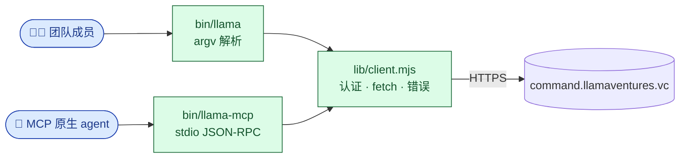

<p align="center">
  
</p>

<h1 align="center">@llamaventures/cli</h1>

<p align="center">
  <strong>Llama Ventures 官方 CLI 与 MCP server。</strong><br/>
  一行 <code>npm install</code>，一套统一的认证链，两个接口——
  团队成员和 AI agent 都通过同一份客户端访问
  <a href="https://command.llamaventures.vc">command.llamaventures.vc</a>。
</p>

<p align="center">
  <a href="https://www.npmjs.com/package/@llamaventures/cli"></a>
  <a href="https://github.com/Llama-Ventures/llama-cli/actions/workflows/ci.yml"></a>
  <a href="https://docs.npmjs.com/trusted-publishers"></a>
  <a href="https://nodejs.org/"></a>
  <a href="https://modelcontextprotocol.io"></a>
  <a href="LICENSE"></a>
</p>

<p align="center">
  <a href="README.md">English</a> · <strong>简体中文</strong>
</p>

<p align="center">
  <a href="#给华人创业者-向-llama-pitch">🚀 向 Llama pitch（无需账号）</a> ·
  <a href="#安装">安装</a> ·
  <a href="#认证">认证</a> ·
  <a href="#cli-速览">CLI</a> ·
  <a href="#mcp-server">MCP</a> ·
  <a href="AGENT_BRIEFING.md">Agent 协议</a> ·
  <a href="SECURITY.md">安全</a> ·
  <a href="CHANGELOG.md">更新日志</a>
</p>

> **公开源码、低摩擦安装；不是开源产品。** 大多数命令需要 Llama Ventures
> 团队账号（联系 [gavin@llamaventures.vc](mailto:gavin@llamaventures.vc)
> 发 token）。**唯一例外是公开的 `pitch` 命令族**——任何创业者、EA、
> 行政助理都能用，不需要 token，详见下方
> [给华人创业者：向 Llama pitch](#给华人创业者-向-llama-pitch)。

---

## 包里有什么

```
@llamaventures/cli
├── bin/llama          给人 + bash 用的交互式 CLI
└── bin/llama-mcp      给 MCP 原生 agent 用的 stdio MCP server，56 个工具
```

两个 binary 共享 `lib/client.mjs`——**同一**认证链、**同一** HTTP 客户端、
**同一**错误格式。CLI 与 MCP 不可能在身份或传输上漂移。CLI 自身零依赖；
MCP server 仅依赖 `@modelcontextprotocol/sdk`（Anthropic 维护，pin 死版本）。



---

## 给华人创业者：向 Llama pitch

如果你是创业者、EA、或者帮老板探索的助理，**不需要 token、不需要找认识的人介绍**——
我们专门为外部 pitch 留了一条公开通道。它跟你在
[command.llamaventures.vc/external-agent](https://command.llamaventures.vc/external-agent)
上看到的网页版聊的是同一个 intake agent，结构化提取、12 维投资判断都是同一套，
只是入口换成了你的终端，或者你自己的 AI 助手。

```bash
# 1. 装 CLI（不需要 Llama 账号）
npm i -g @llamaventures/cli

# 2. 起一个 session
llama pitch start --name "张三" --email "you@yourstartup.com"

# 3. 跟 agent 聊——单条消息
llama pitch say "我们做 X，目标 Y，团队背景 Z..."

# 4. 把 deck / 一页纸传上来
llama pitch upload ./deck.pdf

# 5. 或者直接进交互式 REPL
llama pitch
```

**也可以让你自己的 AI agent 帮你 pitch（A2A）。** 把这个仓库的 MCP server
挂到 Claude / Cursor / Codex / OpenClaw 上（任何能跑 MCP 的 agent 都行），
然后告诉它"帮我 pitch Llama Ventures"。它会用 `pitch_start`、
`pitch_send_message`、`pitch_upload_file`、`pitch_finalize` 这五个工具
跟我们的 intake agent 对话。配置见 [MCP server](#mcp-server)。

**会被服务端约束的上限**（跟网页版一样）：
- 单 IP 每天 5 个 session
- 单邮箱每天 3 个 session
- 30 分钟无活动自动结束
- 单 session 100 条消息 / 1M token

**Pitch 完成后**：agent 会调 `finalize_intake` 写入结构化档案，自动给我们团队
排进 inbox。我们看到后会主动联系你——不需要你再追。

> 想了解 Llama Ventures 在投什么？看 [llamaventures.vc](https://llamaventures.vc)。
> AI、Pre-seed 到 Series A、$3-5M 票，跨美中。**懂得用 AI 写代码、懂得让 AI
> 帮你 pitch 的 founder——我们爱看。**

---

## 安装

```bash
npm i -g @llamaventures/cli
```

需要 **Node 18+**（用了原生 `fetch` 与 ESM）。CI 矩阵覆盖 18 / 20 / 22。

验证：

```bash
llama --version
llama auth status     # 会跑一次 /api/me 验证
```

同一次安装会把 `llama-mcp` 也放到 `PATH` 上——MCP server 不用单独装包。

> **从 `npm link` 升级过来？** CLI 以前住在 `llama-os/cli/` 目录，靠 `npm link`
> 分发。从 v1.x 起改名 `@llamaventures/cli` 走 npm。
> 跑一次 `npm i -g @llamaventures/cli@latest` 就完事；旧目录在 soak 期间
> 还能用，但已经不是 source of truth。详见
> [`llama-os/cli/DEPRECATED.md`](https://github.com/SoujiOkita98/llama-os/blob/main/cli/DEPRECATED.md)。

---

## 认证

客户端**按下面这个顺序**寻找凭证，每次调用都查一遍：

| # | 来源 | 发送的 header | 适合谁 |
|---|------|--------------|--------|
| 1 | `gcloud auth print-identity-token` | `Authorization: Bearer …` | Llama 团队成员（零配置） |
| 2 | `$LLAMA_TOKEN` 环境变量 | `X-Llama-Token` | CI runner、云上 sandbox agent |
| 3 | `~/.llama/token`（mode `0600`） | `X-Llama-Token` | 本地常驻安装 |
| 4 | `~/.llama-command/config.json` | `X-Llama-Token` | CLI v0.1 老路径——首次读取自动迁移到 `~/.llama/token` |

如果 Bearer 和 X-Llama-Token 同时存在，两个一起发。服务器先验 Bearer，
失败后回退到 X-Llama-Token。任何时候都可以用 `llama auth status`
看当前认证身份。

### 零配置 —— 团队成员推荐

```bash
gcloud auth login          # 一次性，选你的 @llamaventures.vc 账号
llama auth status          # → 显示 role + email
llama deal search acme-ai  # 直接用
```

### 手动 token —— 适合无 gcloud / 稳定 CI

1. 登录 https://command.llamaventures.vc。
2. 打开 `/settings/tokens` → **Mint Token**。
3. 保存 `llc_…` 值：

   ```bash
   llama token set llc_paste_token_here
   #  → 写入 ~/.llama/token (mode 0600)
   #  → 落盘前会先打一次 /api/me，无效的 token 不会落到磁盘上
   ```

   或在 CI / 一次性环境里：

   ```bash
   export LLAMA_TOKEN=llc_paste_token_here
   ```

> **没账号？** 邮件 [gavin@llamaventures.vc](mailto:gavin@llamaventures.vc)。
> 任何邮箱（包括非 `@llamaventures.vc`）都能拿 token；system admin
> 在 `/settings/tokens` 里 mint，token 第一次使用时自动建 user 行。

---

## CLI 速览

CLI 是 canonical 接口。底下的 HTTP API 也稳定，但 CLI 帮你处理了认证、错误格式、
schema 前向兼容——**即使你写脚本，也优先用 CLI**。

```bash
# 认证 + token
llama auth status
llama token set <llc_...>
llama token show

# Pipeline——读
llama deal search "acme ai"
llama deal list --owner alex --status Interested
llama deal list --owner alex --status Outreached
llama deal list --source-direction Outbound --status Outreached
llama deal list --owner alex --status Diligence
llama deal show <dealId>

# Pipeline——写
llama deal create "Acme AI" --description "..." --source Gavin --source-direction Outbound --status Interested
llama deal create "Acme AI" --description "..." --source Gavin --source-direction Outbound --status Outreached
llama deal create "Acme AI" --description "..." --source Gavin --source-direction Inbound --status Sourced
llama deal update <dealId> status Diligence
llama deal enrich <dealId> --dry-run
llama deal enrich <dealId> --apply --executor server_agent
llama deal enrich <dealId> --executor external_agent --prompt
llama deal agent run <dealId> --message "collect founder evidence and update typed facts"
llama deal delete  <dealId>     # 软删除（审计日志记录）
llama deal restore <dealId>

# Status 语义
# Interested = 先记录/关注，还没有 outreach、intro、回复、deck submission 或 meeting。
# Outreached = 只是联系/记录了，还没有回复或有效关系。
# Sourced    = 已有回复、intro、会议，或其它真实关系信号。
# sourceDirection 是单独维度：
# Inbound    = 自然流入公司。
# Outbound   = 我们主动发现/建名单/触达。

# Deal Brief——有序的、有类型的 block（text · link · embed · callout）
llama brief blocks       <dealId>
llama brief add-text     <dealId> --heading "..." --body "..."
llama brief add-link     <dealId> --url "..." --label "..."
llama brief add-callout  <dealId> --tone insight --heading "..." --body "..."
llama brief edit         <dealId> <blockId> [--heading ...] [--body ...]
llama brief history      <dealId> <blockId>

# Ownership + 审批
llama claim       <dealId>
llama nominate    <dealId> --user <userId>
llama approvals   list
llama approvals   decide <approvalId> approved --note "..."

# 时间线 + 帖子
llama timeline <dealId>
llama post     <dealId> "消息内容" [--link url]

# Agent runtime——Command 上的 Llama OS skill gateway
llama agent bootstrap
llama skills search "wiki delete tombstone"
llama skills show llama-command
llama explain https://command.llamaventures.vc/wiki/some-page

# Wiki
llama wiki search "<query>"
llama wiki save <slug> --title "..." --content "..."

# Mentions 收件箱
llama mentions
llama mentions resolve <mentionId>
```

跑 `llama --help` 看完整命令清单（50+ 个命令，覆盖 deals、briefs、ownership、
timeline、facts、wiki、mentions、skill corrections、admin event feeds）。
所有删除默认软删除——可恢复，且通过 `deal_events` 留下审计痕迹。

### 错误码（给 agent 用）

CLI 在 stderr 里抛错时带稳定的、可解析的前缀：

| 前缀 | 含义 | 怎么恢复 |
|------|------|---------|
| `Error[NO_AUTH]` | 一个凭证都没找到 | `gcloud auth login` **或** `llama token set` |
| `Error[UNAUTHORIZED]` | 服务端拒绝了我们发出去的凭证 | token 可能被 revoke / 过期 / gcloud 选错账号 |

MCP server 在 `isError: true` 内容里返回相同的前缀，agent 不用解析自然语言就能 pattern-match。

---

## MCP server

随包发布的 `llama-mcp` 是一个 **stdio Model Context Protocol** server，
暴露 **56 个 typed tools**——基本镜像 CLI 最常用的命令。每个 tool 都是
具名、scoped 的；**没有**通用的 API passthrough，这是有意设计的（公开
package 里一个能被 prompt-injection 触达的逃生通道，正是我们要避开的形状）。

覆盖面按 agent 真正会用的工作流分组：auth 诊断；live agent bootstrap；
授权后的 Llama OS skill search/read；Command URL/object inspect；deal search/show/create/
update/feed；服务端 deal agent run；deal enrichment harness；带 trust ladder 的事实；brief blocks
和版本历史；wiki 读写删恢复；timeline posts 和 mentions；skill corrections；
refresh triggers；外部 pitch intake；memo show/regenerate/save/reset；
以及 deal-scoped HTML docs、versions、bundles、restore/reset。

精确的 live list 以 `tools/list` 为准：

```bash
printf '%s\n' \
  '{"jsonrpc":"2.0","id":1,"method":"initialize","params":{"protocolVersion":"2024-11-05","capabilities":{},"clientInfo":{"name":"dev","version":"1"}}}' \
  '{"jsonrpc":"2.0","method":"notifications/initialized"}' \
  '{"jsonrpc":"2.0","id":2,"method":"tools/list"}' \
  | llama-mcp
```

认证链跟 CLI 完全一样（gcloud → `$LLAMA_TOKEN` → `~/.llama/token`）。
`agent_briefing` 这个 MCP **prompt** 会在认证后拉取 Command 服务端的
Agent Runtime Contract——刚装上 server 的 agent 不用离开协议就能给自己
onboard。包内 [`AGENT_BRIEFING.md`](AGENT_BRIEFING.md) 只是服务端 briefing
临时不可用时的 fallback。

要读当前 Llama OS skills，用 runtime tools：`agent_bootstrap`、
`skills_search`、`skills_read`、`object_inspect`。公开 npm 包不打包私有
skill 正文；Command 只按当前 token 的权限返回可见内容。

### 接到你的 agent 上

<details open>
<summary><strong>Claude Desktop</strong>（macOS 路径示例）</summary>

`~/Library/Application Support/Claude/claude_desktop_config.json`：

```json
{
  "mcpServers": {
    "llama": { "command": "llama-mcp" }
  }
}
```

重启 Claude Desktop。工具会出现在 🛠️ 菜单里。
</details>

<details>
<summary><strong>Claude Code</strong></summary>

```bash
claude mcp add llama -- llama-mcp
```

或直接编辑 `~/.claude/claude.json`——JSON 结构和 Desktop 一样。
</details>

<details>
<summary><strong>Cursor</strong></summary>

`~/.cursor/mcp.json`：

```json
{
  "mcpServers": {
    "llama": { "command": "llama-mcp" }
  }
}
```
</details>

<details>
<summary><strong>OpenCode / OpenClaw / Codex / 任何其它 stdio MCP 客户端</strong></summary>

大部分客户端都接受 `command` + `args`。先 `which llama-mcp` 找到可执行路径
（一般是 `/usr/local/bin/llama-mcp` 或 `~/.npm-global/bin/llama-mcp`），
把客户端指过去就行。无需协议扩展、无需 transport flag。
</details>

> 想让 agent 自己 onboard？跑 `llama agent-onboard`，或者从 MCP server
> 拉 `agent_briefing` prompt——它会拿 Command 服务端的工作合约（CLI 状态、
> attribution 语法、错误恢复、anti-pollution 规则）。

---

## 稳定性

- **版本号：** 走 [SemVer](https://semver.org)。重命名或删除 CLI 命令 → **major**。
  新增 tool / command / flag → minor。修 bug → patch。CLI 自带 `--version`；
  MCP server 在 `serverInfo` 里报告同一个值。
- **向后兼容：** wire format（Bearer / X-Llama-Token）和 `Error[…]` 前缀
  是公开契约，major 版本内不会变。
- **服务端 schema 漂移：** 当 API 多了一个端点，下一个 minor 版本会带
  typed wrapper。在那之前，可以用 `llama` CLI 本身——它自带 40+ 命令
  覆盖整个 API 表面，足够顶住 MCP 还没包到的端点。

详见 [`CHANGELOG.md`](CHANGELOG.md)。

---

## 安全

- **`@llamaventures/cli` 通过 npm
  [Trusted Publishers](https://docs.npmjs.com/trusted-publishers) 发布**——
  仓库里**没有** `NPM_TOKEN`，发不出来 token 也就泄漏不了。
  每个版本带 `--provenance`（sigstore 签名），npm 会显示 **Provenance** 徽章，
  可追溯到具体的 GitHub Action workflow 和 commit。
- **依赖树最小化。** CLI 本身零依赖；MCP server 只依赖
  `@modelcontextprotocol/sdk`，pin 死版本。
- **Branch protection** 锁 `main`；Dependabot、secret scanning、
  push protection 都开了。
- **Token：** 本地存在 `~/.llama/token`，mode `0600`。服务端只存 sha256 hash——
  明文只会在用户手里出现，永远不在数据库里。

报告漏洞：见 [`SECURITY.md`](SECURITY.md)。**不要**在公开 issue 里报安全 bug。

---

## 贡献

这是 Llama Ventures 内部维护的工具。团队成员的 PR 欢迎——
详见 [`CONTRIBUTING.md`](CONTRIBUTING.md)（本地开发环、发版流程、
项目约定：零依赖、CLI/MCP 同步、稳定的 `Error[…]` 前缀）。

外部贡献：文档错漏、流程报告类的 issue 欢迎。如果你想做的事是
"我想让 Llama Ventures 看到我的项目"——请走
[向 Llama pitch](#给华人创业者-向-llama-pitch) 那条路。

---

## License

[MIT](LICENSE) — © 2026 Llama Ventures, Inc.
